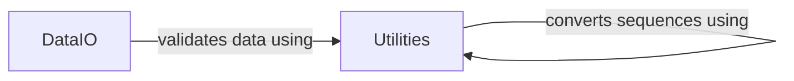

## Component Details

This graph illustrates the Core Data Management subsystem of CoSpred, which is responsible for handling data input/output operations, primarily with HDF5 and Arrow formats, and providing essential utility functions for data manipulation and validation. The main flow involves data being read and written by the DataIO component, which relies on the Utilities component for data validation and transformation tasks.

### DataIO
This component handles the input and output operations for the CoSpred subsystem, primarily dealing with HDF5 and Arrow file formats. It includes functions for reading and writing data, and preparing datasets for model training and prediction.

**Related Classes/Methods**:

- <a href="https://github.com/pfizer-opensource/CoSpred/blob/master/prosit_model/io_local.py#L13-L15" target="_blank" rel="noopener noreferrer">`CoSpred.prosit_model.io_local:get_array` (13:15)</a>
- <a href="https://github.com/pfizer-opensource/CoSpred/blob/master/prosit_model/io_local.py#L26-L35" target="_blank" rel="noopener noreferrer">`CoSpred.prosit_model.io_local:to_hdf5` (26:35)</a>
- <a href="https://github.com/pfizer-opensource/CoSpred/blob/master/prosit_model/io_local.py#L52-L116" target="_blank" rel="noopener noreferrer">`CoSpred.prosit_model.io_local:from_hdf5_to_transformer` (52:116)</a>
- <a href="https://github.com/pfizer-opensource/CoSpred/blob/master/prosit_model/io_local.py#L119-L176" target="_blank" rel="noopener noreferrer">`CoSpred.prosit_model.io_local:from_hdf5` (119:176)</a>
- <a href="https://github.com/pfizer-opensource/CoSpred/blob/master/prosit_model/io_local.py#L179-L188" target="_blank" rel="noopener noreferrer">`CoSpred.prosit_model.io_local:pdfile_to_arrow` (179:188)</a>
- <a href="https://github.com/pfizer-opensource/CoSpred/blob/master/prosit_model/io_local.py#L207-L237" target="_blank" rel="noopener noreferrer">`CoSpred.prosit_model.io_local:to_arrow` (207:237)</a>
- <a href="https://github.com/pfizer-opensource/CoSpred/blob/master/prosit_model/io_local.py#L240-L283" target="_blank" rel="noopener noreferrer">`CoSpred.prosit_model.io_local:from_arrow` (240:283)</a>

### Utilities
This component provides various utility functions used across the CoSpred subsystem. These functions include data validation, reshaping arrays, and converting sequence data between integer and string representations.

**Related Classes/Methods**:

- <a href="https://github.com/pfizer-opensource/CoSpred/blob/master/prosit_model/utils.py#L4-L8" target="_blank" rel="noopener noreferrer">`CoSpred.prosit_model.utils:check_mandatory_keys` (4:8)</a>
- <a href="https://github.com/pfizer-opensource/CoSpred/blob/master/prosit_model/utils.py#L11-L12" target="_blank" rel="noopener noreferrer">`CoSpred.prosit_model.utils:reshape_dims` (11:12)</a>
- <a href="https://github.com/pfizer-opensource/CoSpred/blob/master/prosit_model/utils.py#L15-L17" target="_blank" rel="noopener noreferrer">`CoSpred.prosit_model.utils:get_sequence` (15:17)</a>
- <a href="https://github.com/pfizer-opensource/CoSpred/blob/master/prosit_model/utils.py#L20-L22" target="_blank" rel="noopener noreferrer">`CoSpred.prosit_model.utils:sequence_integer_to_str` (20:22)</a>
- <a href="https://github.com/pfizer-opensource/CoSpred/blob/master/prosit_model/utils.py#L25-L39" target="_blank" rel="noopener noreferrer">`CoSpred.prosit_model.utils:peptide_parser` (25:39)</a>

### [FAQ](https://github.com/CodeBoarding/GeneratedOnBoardings/tree/main?tab=readme-ov-file#faq)