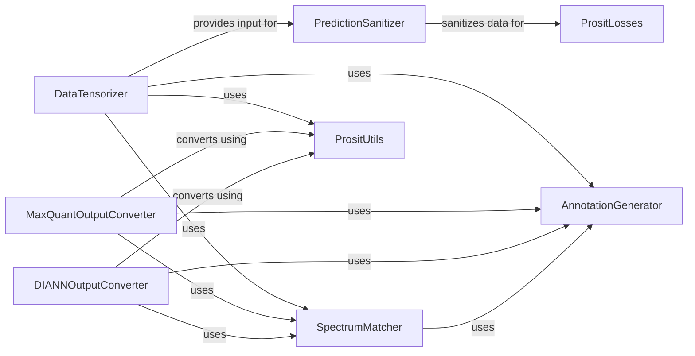

## Component Details

The Data Preparation & Annotation subsystem is crucial for processing raw mass spectrometry data into a usable format for the Prosit model and for generating interpretable outputs. It encompasses data sanitization, transformation into tensors, peptide fragment annotation with m/z values, and matching operations against experimental data. This subsystem ensures data quality, prepares it for machine learning, and facilitates the comparison and conversion of prediction results into various standard formats.

### PredictionSanitizer
This component is responsible for sanitizing and normalizing predicted intensity data. It handles reshaping dimensions, masking out-of-range or out-of-charge values, normalizing base peaks, and calculating spectral angles for evaluation. It ensures the intensity data is in the correct format and quality for further processing or comparison.

**Related Classes/Methods**:

- <a href="https://github.com/pfizer-opensource/CoSpred/blob/master/prosit_model/sanitize.py#L7-L19" target="_blank" rel="noopener noreferrer">`CoSpred.prosit_model.sanitize:reshape_dims` (7:19)</a>
- <a href="https://github.com/pfizer-opensource/CoSpred/blob/master/prosit_model/sanitize.py#L22-L25" target="_blank" rel="noopener noreferrer">`CoSpred.prosit_model.sanitize:reshape_flat` (22:25)</a>
- <a href="https://github.com/pfizer-opensource/CoSpred/blob/master/prosit_model/sanitize.py#L28-L35" target="_blank" rel="noopener noreferrer">`CoSpred.prosit_model.sanitize:normalize_base_peak` (28:35)</a>
- <a href="https://github.com/pfizer-opensource/CoSpred/blob/master/prosit_model/sanitize.py#L38-L42" target="_blank" rel="noopener noreferrer">`CoSpred.prosit_model.sanitize:mask_outofrange` (38:42)</a>
- <a href="https://github.com/pfizer-opensource/CoSpred/blob/master/prosit_model/sanitize.py#L45-L46" target="_blank" rel="noopener noreferrer">`CoSpred.prosit_model.sanitize:cap` (45:46)</a>
- <a href="https://github.com/pfizer-opensource/CoSpred/blob/master/prosit_model/sanitize.py#L49-L54" target="_blank" rel="noopener noreferrer">`CoSpred.prosit_model.sanitize:mask_outofcharge` (49:54)</a>
- <a href="https://github.com/pfizer-opensource/CoSpred/blob/master/prosit_model/sanitize.py#L57-L81" target="_blank" rel="noopener noreferrer">`CoSpred.prosit_model.sanitize:get_spectral_angle` (57:81)</a>
- <a href="https://github.com/pfizer-opensource/CoSpred/blob/master/prosit_model/sanitize.py#L84-L106" target="_blank" rel="noopener noreferrer">`CoSpred.prosit_model.sanitize:prediction` (84:106)</a>

### AnnotationGenerator
This component focuses on generating annotations for mass spectrometry data. It provides functionalities to calculate m/z values and retrieve full annotations based on these calculations. It's crucial for interpreting and labeling spectral data.

**Related Classes/Methods**:

- <a href="https://github.com/pfizer-opensource/CoSpred/blob/master/prosit_model/annotate.py#L7-L14" target="_blank" rel="noopener noreferrer">`CoSpred.prosit_model.annotate:adjust_masses` (7:14)</a>
- <a href="https://github.com/pfizer-opensource/CoSpred/blob/master/prosit_model/annotate.py#L17-L18" target="_blank" rel="noopener noreferrer">`CoSpred.prosit_model.annotate:get_mz` (17:18)</a>
- <a href="https://github.com/pfizer-opensource/CoSpred/blob/master/prosit_model/annotate.py#L21-L22" target="_blank" rel="noopener noreferrer">`CoSpred.prosit_model.annotate:get_mzs` (21:22)</a>
- <a href="https://github.com/pfizer-opensource/CoSpred/blob/master/prosit_model/annotate.py#L25-L43" target="_blank" rel="noopener noreferrer">`CoSpred.prosit_model.annotate:get_annotation` (25:43)</a>

### SpectrumMatcher
The Spectrum Matcher component is responsible for matching predicted and experimental spectra. It includes functionalities for parsing peptides, determining tolerance, performing binary searches for efficient matching, and augmenting results. This component is vital for comparing and validating predicted spectral data against observed data.

**Related Classes/Methods**:

- <a href="https://github.com/pfizer-opensource/CoSpred/blob/master/prosit_model/match.py#L7-L11" target="_blank" rel="noopener noreferrer">`CoSpred.prosit_model.match:read_attribute` (7:11)</a>
- <a href="https://github.com/pfizer-opensource/CoSpred/blob/master/prosit_model/match.py#L14-L27" target="_blank" rel="noopener noreferrer">`CoSpred.prosit_model.match:peptide_parser` (14:27)</a>
- <a href="https://github.com/pfizer-opensource/CoSpred/blob/master/prosit_model/match.py#L30-L35" target="_blank" rel="noopener noreferrer">`CoSpred.prosit_model.match:get_forward_backward` (30:35)</a>
- <a href="https://github.com/pfizer-opensource/CoSpred/blob/master/prosit_model/match.py#L38-L48" target="_blank" rel="noopener noreferrer">`CoSpred.prosit_model.match:get_tolerance` (38:48)</a>
- <a href="https://github.com/pfizer-opensource/CoSpred/blob/master/prosit_model/match.py#L51-L55" target="_blank" rel="noopener noreferrer">`CoSpred.prosit_model.match:is_in_tolerance` (51:55)</a>
- <a href="https://github.com/pfizer-opensource/CoSpred/blob/master/prosit_model/match.py#L58-L68" target="_blank" rel="noopener noreferrer">`CoSpred.prosit_model.match:binarysearch` (58:68)</a>
- <a href="https://github.com/pfizer-opensource/CoSpred/blob/master/prosit_model/match.py#L71-L96" target="_blank" rel="noopener noreferrer">`CoSpred.prosit_model.match:match` (71:96)</a>
- <a href="https://github.com/pfizer-opensource/CoSpred/blob/master/prosit_model/match.py#L99-L112" target="_blank" rel="noopener noreferrer">`CoSpred.prosit_model.match:c_lambda` (99:112)</a>
- <a href="https://github.com/pfizer-opensource/CoSpred/blob/master/prosit_model/match.py#L115-L135" target="_blank" rel="noopener noreferrer">`CoSpred.prosit_model.match:augment` (115:135)</a>

### DataTensorizer
This component handles the conversion of raw data, typically from CSV format, into a tensorized representation suitable for machine learning models. It involves extracting numerical values, converting sequences to integers, one-hot encoding precursor charges, and applying m/z transformations. It also utilizes sanitization functions to prepare the data.

**Related Classes/Methods**:

- <a href="https://github.com/pfizer-opensource/CoSpred/blob/master/prosit_model/tensorize.py#L89-L120" target="_blank" rel="noopener noreferrer">`CoSpred.prosit_model.tensorize.csv` (89:120)</a>
- <a href="https://github.com/pfizer-opensource/CoSpred/blob/master/prosit_model/tensorize.py#L34-L36" target="_blank" rel="noopener noreferrer">`CoSpred.prosit_model.tensorize.get_numbers` (34:36)</a>
- <a href="https://github.com/pfizer-opensource/CoSpred/blob/master/prosit_model/tensorize.py#L46-L55" target="_blank" rel="noopener noreferrer">`CoSpred.prosit_model.tensorize.get_sequence_integer` (46:55)</a>
- <a href="https://github.com/pfizer-opensource/CoSpred/blob/master/prosit_model/tensorize.py#L39-L43" target="_blank" rel="noopener noreferrer">`CoSpred.prosit_model.tensorize.get_precursor_charge_onehot` (39:43)</a>
- <a href="https://github.com/pfizer-opensource/CoSpred/blob/master/prosit_model/tensorize.py#L68-L86" target="_blank" rel="noopener noreferrer">`CoSpred.prosit_model.tensorize.get_mz_applied` (68:86)</a>

### DIANNOutputConverter
This component is responsible for converting prediction results into a format compatible with DIANN software. It involves reshaping dimensions, converting sequence integers to strings, and utilizing matching and annotation functionalities to produce the desired output format.

**Related Classes/Methods**:

- <a href="https://github.com/pfizer-opensource/CoSpred/blob/master/prosit_model/converters/diannoutput.py#L66-L131" target="_blank" rel="noopener noreferrer">`CoSpred.prosit_model.converters.diannoutput:convert_prediction` (66:131)</a>
- <a href="https://github.com/pfizer-opensource/CoSpred/blob/master/prosit_model/converters/diannoutput.py#L75-L101" target="_blank" rel="noopener noreferrer">`CoSpred.prosit_model.converters.diannoutput.convert_prediction.convert_row` (75:101)</a>
- <a href="https://github.com/pfizer-opensource/CoSpred/blob/master/prosit_model/converters/diannoutput.py#L138-L148" target="_blank" rel="noopener noreferrer">`CoSpred.prosit_model.converters.diannoutput.createLongFileFormat:__init__` (138:148)</a>

### MaxQuantOutputConverter
This component handles the conversion of prediction results into a format suitable for MaxQuant software. Similar to the DIANN converter, it involves reshaping dimensions, converting sequence integers, and leveraging matching and annotation functionalities to generate the MaxQuant-compatible output.

**Related Classes/Methods**:

- <a href="https://github.com/pfizer-opensource/CoSpred/blob/master/prosit_model/converters/maxquant.py#L67-L119" target="_blank" rel="noopener noreferrer">`CoSpred.prosit_model.converters.maxquant:convert_prediction` (67:119)</a>
- <a href="https://github.com/pfizer-opensource/CoSpred/blob/master/prosit_model/converters/maxquant.py#L75-L100" target="_blank" rel="noopener noreferrer">`CoSpred.prosit_model.converters.maxquant.convert_prediction.convert_row` (75:100)</a>

### PrositLosses
This component encapsulates the loss functions used within the Prosit model, specifically the masked spectral distance. It's crucial for evaluating the difference between predicted and true spectra.

**Related Classes/Methods**:

- <a href="https://github.com/pfizer-opensource/CoSpred/blob/master/prosit_model/losses.py#L5-L17" target="_blank" rel="noopener noreferrer">`CoSpred.prosit_model.losses.masked_spectral_distance` (5:17)</a>

### PrositUtils
This component provides utility functions used across different parts of the Prosit model, such as reshaping dimensions and converting sequence integers to strings. These are general-purpose helpers that support various data manipulation tasks.

**Related Classes/Methods**:

- <a href="https://github.com/pfizer-opensource/CoSpred/blob/master/prosit_model/utils.py#L11-L12" target="_blank" rel="noopener noreferrer">`CoSpred.prosit_model.utils.reshape_dims` (11:12)</a>
- <a href="https://github.com/pfizer-opensource/CoSpred/blob/master/prosit_model/utils.py#L20-L22" target="_blank" rel="noopener noreferrer">`CoSpred.prosit_model.utils.sequence_integer_to_str` (20:22)</a>

### [FAQ](https://github.com/CodeBoarding/GeneratedOnBoardings/tree/main?tab=readme-ov-file#faq)