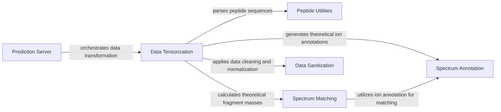

## Component Details

This graph illustrates the key components and their interactions within the CoSpred prediction system, focusing on the data processing pipeline from raw input to tensorized data ready for model prediction. The Prediction Server acts as the orchestrator, receiving requests and delegating data transformation to the Data Tensorization component. Data Tensorization, in turn, relies on various utility components for peptide parsing, theoretical m/z calculation, and data sanitization, ensuring the data is in the correct numerical tensor format for subsequent machine learning tasks.

### Prediction Server
This component acts as the entry point for external prediction requests, exposing API endpoints. It receives peptide data, orchestrates its tensorization, performs predictions using loaded models, and converts the results into various output formats (generic, MSP, MSMS).

**Related Classes/Methods**:

- <a href="https://github.com/pfizer-opensource/CoSpred/blob/master/prosit_model/server.py#L28-L33" target="_blank" rel="noopener noreferrer">`CoSpred.prosit_model.server:predict` (28:33)</a>
- <a href="https://github.com/pfizer-opensource/CoSpred/blob/master/prosit_model/server.py#L37-L48" target="_blank" rel="noopener noreferrer">`CoSpred.prosit_model.server:return_generic` (37:48)</a>
- <a href="https://github.com/pfizer-opensource/CoSpred/blob/master/prosit_model/server.py#L52-L63" target="_blank" rel="noopener noreferrer">`CoSpred.prosit_model.server:return_msp` (52:63)</a>
- <a href="https://github.com/pfizer-opensource/CoSpred/blob/master/prosit_model/server.py#L67-L78" target="_blank" rel="noopener noreferrer">`CoSpred.prosit_model.server:return_msms` (67:78)</a>

### Data Tensorization
This component is responsible for transforming raw input data (e.g., from CSV or HDF5 files) into a numerical tensor format suitable for machine learning models. It handles sequence encoding, charge one-hot encoding, and calculation of theoretical m/z values, and applies sanitization.

**Related Classes/Methods**:

- <a href="https://github.com/pfizer-opensource/CoSpred/blob/master/prosit_model/tensorize.py#L19-L31" target="_blank" rel="noopener noreferrer">`CoSpred.prosit_model.tensorize:stack` (19:31)</a>
- <a href="https://github.com/pfizer-opensource/CoSpred/blob/master/prosit_model/tensorize.py#L34-L36" target="_blank" rel="noopener noreferrer">`CoSpred.prosit_model.tensorize:get_numbers` (34:36)</a>
- <a href="https://github.com/pfizer-opensource/CoSpred/blob/master/prosit_model/tensorize.py#L39-L43" target="_blank" rel="noopener noreferrer">`CoSpred.prosit_model.tensorize:get_precursor_charge_onehot` (39:43)</a>
- <a href="https://github.com/pfizer-opensource/CoSpred/blob/master/prosit_model/tensorize.py#L46-L55" target="_blank" rel="noopener noreferrer">`CoSpred.prosit_model.tensorize:get_sequence_integer` (46:55)</a>
- <a href="https://github.com/pfizer-opensource/CoSpred/blob/master/prosit_model/tensorize.py#L58-L65" target="_blank" rel="noopener noreferrer">`CoSpred.prosit_model.tensorize:parse_ion` (58:65)</a>
- <a href="https://github.com/pfizer-opensource/CoSpred/blob/master/prosit_model/tensorize.py#L68-L86" target="_blank" rel="noopener noreferrer">`CoSpred.prosit_model.tensorize:get_mz_applied` (68:86)</a>
- <a href="https://github.com/pfizer-opensource/CoSpred/blob/master/prosit_model/tensorize.py#L89-L120" target="_blank" rel="noopener noreferrer">`CoSpred.prosit_model.tensorize:csv` (89:120)</a>
- <a href="https://github.com/pfizer-opensource/CoSpred/blob/master/prosit_model/tensorize.py#L123-L138" target="_blank" rel="noopener noreferrer">`CoSpred.prosit_model.tensorize:hdf5` (123:138)</a>

### Peptide Utilities
This utility component provides functions for parsing peptide sequences, converting them to integer representations, and handling other peptide-related transformations.

**Related Classes/Methods**:

- <a href="https://github.com/pfizer-opensource/CoSpred/blob/master/prosit_model/utils.py#L25-L39" target="_blank" rel="noopener noreferrer">`prosit_model.utils.peptide_parser:peptide_parser` (25:39)</a>
- <a href="https://github.com/pfizer-opensource/CoSpred/blob/master/prosit_model/utils.py#L15-L17" target="_blank" rel="noopener noreferrer">`prosit_model.utils.peptide_parser:get_sequence` (15:17)</a>
- <a href="https://github.com/pfizer-opensource/CoSpred/blob/master/prosit_model/utils.py#L20-L22" target="_blank" rel="noopener noreferrer">`prosit_model.utils.peptide_parser:sequence_integer_to_str` (20:22)</a>

### Spectrum Matching
This component focuses on matching observed mass spectrometry peaks with theoretical fragment ion masses. It calculates forward and backward cumulative masses and performs binary searches for matches within a specified tolerance.

**Related Classes/Methods**:

- <a href="https://github.com/pfizer-opensource/CoSpred/blob/master/prosit_model/match.py#L30-L35" target="_blank" rel="noopener noreferrer">`prosit_model.match:get_forward_backward` (30:35)</a>
- <a href="https://github.com/pfizer-opensource/CoSpred/blob/master/prosit_model/match.py#L71-L96" target="_blank" rel="noopener noreferrer">`prosit_model.match:match` (71:96)</a>
- <a href="https://github.com/pfizer-opensource/CoSpred/blob/master/prosit_model/match.py#L51-L55" target="_blank" rel="noopener noreferrer">`prosit_model.match:is_in_tolerance` (51:55)</a>
- <a href="https://github.com/pfizer-opensource/CoSpred/blob/master/prosit_model/match.py#L58-L68" target="_blank" rel="noopener noreferrer">`prosit_model.match:binarysearch` (58:68)</a>

### Spectrum Annotation
This component is responsible for generating theoretical m/z values for various fragment ions (e.g., b and y ions) based on peptide sequences and charge states, including neutral losses.

**Related Classes/Methods**:

- <a href="https://github.com/pfizer-opensource/CoSpred/blob/master/prosit_model/annotate.py#L25-L43" target="_blank" rel="noopener noreferrer">`prosit_model.annotate:get_annotation` (25:43)</a>
- <a href="https://github.com/pfizer-opensource/CoSpred/blob/master/prosit_model/annotate.py#L17-L18" target="_blank" rel="noopener noreferrer">`prosit_model.annotate:get_mz` (17:18)</a>
- <a href="https://github.com/pfizer-opensource/CoSpred/blob/master/prosit_model/annotate.py#L21-L22" target="_blank" rel="noopener noreferrer">`prosit_model.annotate:get_mzs` (21:22)</a>

### Data Sanitization
This component provides functions for cleaning and normalizing tensor data. It includes operations like reshaping dimensions, masking out-of-range values, capping, and normalizing by base peak.

**Related Classes/Methods**:

- <a href="https://github.com/pfizer-opensource/CoSpred/blob/master/prosit_model/sanitize.py#L45-L46" target="_blank" rel="noopener noreferrer">`prosit_model.sanitize:cap` (45:46)</a>
- <a href="https://github.com/pfizer-opensource/CoSpred/blob/master/prosit_model/sanitize.py#L38-L42" target="_blank" rel="noopener noreferrer">`prosit_model.sanitize:mask_outofrange` (38:42)</a>
- <a href="https://github.com/pfizer-opensource/CoSpred/blob/master/prosit_model/sanitize.py#L49-L54" target="_blank" rel="noopener noreferrer">`prosit_model.sanitize:mask_outofcharge` (49:54)</a>
- <a href="https://github.com/pfizer-opensource/CoSpred/blob/master/prosit_model/sanitize.py#L7-L19" target="_blank" rel="noopener noreferrer">`prosit_model.sanitize:reshape_dims` (7:19)</a>
- <a href="https://github.com/pfizer-opensource/CoSpred/blob/master/prosit_model/sanitize.py#L22-L25" target="_blank" rel="noopener noreferrer">`prosit_model.sanitize:reshape_flat` (22:25)</a>
- <a href="https://github.com/pfizer-opensource/CoSpred/blob/master/prosit_model/sanitize.py#L28-L35" target="_blank" rel="noopener noreferrer">`prosit_model.sanitize:normalize_base_peak` (28:35)</a>

### [FAQ](https://github.com/CodeBoarding/GeneratedOnBoardings/tree/main?tab=readme-ov-file#faq)