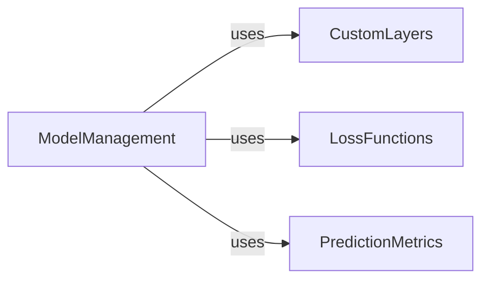

## Component Details

This graph outlines the core components responsible for managing the prediction model's lifecycle, including loading and saving models, defining custom neural network layers, computing various performance metrics, and providing custom loss functions for training. The main flow involves the ModelManagement component utilizing CustomLayers for model architecture, LossFunctions during training, and PredictionMetrics for evaluating the model's performance.

### ModelManagement
Manages the lifecycle of the prediction model, including loading pre-trained weights and custom layers, and provides utilities to identify the best weight file based on loss values.

**Related Classes/Methods**:

- <a href="https://github.com/pfizer-opensource/CoSpred/blob/master/prosit_model/model.py#L14-L15" target="_blank" rel="noopener noreferrer">`CoSpred.prosit_model.model:is_weight_name` (14:15)</a>
- <a href="https://github.com/pfizer-opensource/CoSpred/blob/master/prosit_model/model.py#L18-L19" target="_blank" rel="noopener noreferrer">`CoSpred.prosit_model.model:get_loss` (18:19)</a>
- <a href="https://github.com/pfizer-opensource/CoSpred/blob/master/prosit_model/model.py#L22-L29" target="_blank" rel="noopener noreferrer">`CoSpred.prosit_model.model:get_best_weights_path` (22:29)</a>
- <a href="https://github.com/pfizer-opensource/CoSpred/blob/master/prosit_model/model.py#L32-L46" target="_blank" rel="noopener noreferrer">`CoSpred.prosit_model.model:load` (32:46)</a>
- <a href="https://github.com/pfizer-opensource/CoSpred/blob/master/prosit_model/model.py#L49-L56" target="_blank" rel="noopener noreferrer">`CoSpred.prosit_model.model:save` (49:56)</a>

### CustomLayers
Defines custom neural network layers, such as attention mechanisms, used within the prediction model.

**Related Classes/Methods**:

- <a href="https://github.com/pfizer-opensource/CoSpred/blob/master/prosit_model/layers.py#L65-L78" target="_blank" rel="noopener noreferrer">`CoSpred.prosit_model.layers.CustomAttention:call` (65:78)</a>
- `CoSpred.prosit_model.layers.dot_product` (full file reference)

### PredictionMetrics
Provides functionalities for computing various performance metrics to evaluate prediction quality, including binary classification metrics and spectral similarity metrics.

**Related Classes/Methods**:

- <a href="https://github.com/pfizer-opensource/CoSpred/blob/master/prosit_model/metrics.py#L6-L8" target="_blank" rel="noopener noreferrer">`CoSpred.prosit_model.metrics.CustomMetric:__init__` (6:8)</a>
- <a href="https://github.com/pfizer-opensource/CoSpred/blob/master/prosit_model/metrics.py#L10-L11" target="_blank" rel="noopener noreferrer">`CoSpred.prosit_model.metrics.CustomMetric:update_state` (10:11)</a>
- <a href="https://github.com/pfizer-opensource/CoSpred/blob/master/prosit_model/metrics.py#L15-L16" target="_blank" rel="noopener noreferrer">`CoSpred.prosit_model.metrics.CustomMetric:result` (15:16)</a>
- <a href="https://github.com/pfizer-opensource/CoSpred/blob/master/prosit_model/metrics.py#L18-L19" target="_blank" rel="noopener noreferrer">`CoSpred.prosit_model.metrics.CustomMetric:reset_state` (18:19)</a>
- <a href="https://github.com/pfizer-opensource/CoSpred/blob/master/prosit_model/metrics.py#L22-L27" target="_blank" rel="noopener noreferrer">`CoSpred.prosit_model.metrics.spectral_distance` (22:27)</a>
- <a href="https://github.com/pfizer-opensource/CoSpred/blob/master/prosit_model/metrics.py#L30-L38" target="_blank" rel="noopener noreferrer">`CoSpred.prosit_model.metrics.masked_spectral_distance` (30:38)</a>
- <a href="https://github.com/pfizer-opensource/CoSpred/blob/master/prosit_model/metrics.py#L41-L46" target="_blank" rel="noopener noreferrer">`CoSpred.prosit_model.metrics.pearson_corr` (41:46)</a>
- <a href="https://github.com/pfizer-opensource/CoSpred/blob/master/prosit_model/metrics.py#L49-L53" target="_blank" rel="noopener noreferrer">`CoSpred.prosit_model.metrics.cos_sim` (49:53)</a>
- <a href="https://github.com/pfizer-opensource/CoSpred/blob/master/prosit_model/metrics.py#L56-L65" target="_blank" rel="noopener noreferrer">`CoSpred.prosit_model.metrics.binarize` (56:65)</a>
- <a href="https://github.com/pfizer-opensource/CoSpred/blob/master/prosit_model/metrics.py#L69-L72" target="_blank" rel="noopener noreferrer">`CoSpred.prosit_model.metrics.ComputeMetrics:__init__` (69:72)</a>
- <a href="https://github.com/pfizer-opensource/CoSpred/blob/master/prosit_model/metrics.py#L74-L135" target="_blank" rel="noopener noreferrer">`CoSpred.prosit_model.metrics.ComputeMetrics:update_state` (74:135)</a>
- <a href="https://github.com/pfizer-opensource/CoSpred/blob/master/prosit_model/metrics.py#L137-L162" target="_blank" rel="noopener noreferrer">`CoSpred.prosit_model.metrics.ComputeMetrics:return_metrics` (137:162)</a>
- <a href="https://github.com/pfizer-opensource/CoSpred/blob/master/prosit_model/metrics.py#L164-L168" target="_blank" rel="noopener noreferrer">`CoSpred.prosit_model.metrics.ComputeMetrics:result` (164:168)</a>

### LossFunctions
Provides custom loss functions used in the model training process.

**Related Classes/Methods**:

- <a href="https://github.com/pfizer-opensource/CoSpred/blob/master/prosit_model/losses.py#L5-L17" target="_blank" rel="noopener noreferrer">`CoSpred.prosit_model.losses.masked_spectral_distance` (5:17)</a>

### [FAQ](https://github.com/CodeBoarding/GeneratedOnBoardings/tree/main?tab=readme-ov-file#faq)