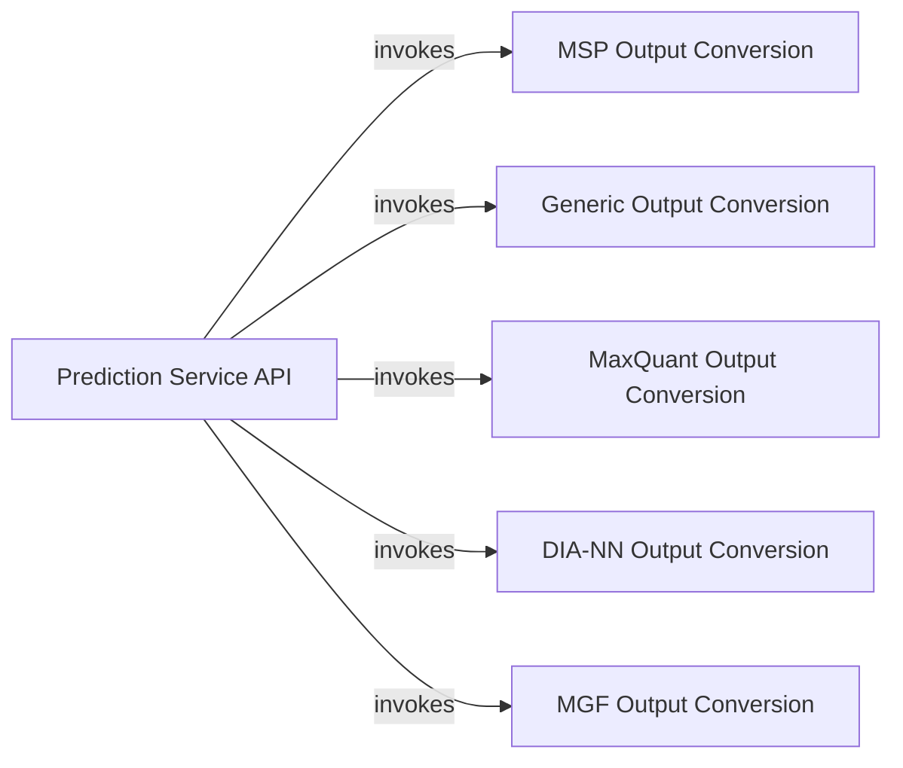

## Component Details

The Output & Conversion Services subsystem provides the core prediction service API, orchestrating the data flow from input to output. Its primary purpose is to facilitate the conversion of prediction results into various standardized formats, including DIANN, MSP, MGF, CSV, and MaxQuant, ensuring compatibility with different downstream analysis tools. The Prediction Service API acts as the central orchestrator, invoking specific conversion components based on the requested output format.

### Prediction Service API
Provides the core prediction service API, receiving peptide data, performing predictions, and orchestrating the return of results in various formats.

**Related Classes/Methods**:

- <a href="https://github.com/pfizer-opensource/CoSpred/blob/master/prosit_model/server.py#L24-L25" target="_blank" rel="noopener noreferrer">`CoSpred.prosit_model.server:hello` (24:25)</a>
- <a href="https://github.com/pfizer-opensource/CoSpred/blob/master/prosit_model/server.py#L28-L33" target="_blank" rel="noopener noreferrer">`CoSpred.prosit_model.server:predict` (28:33)</a>
- <a href="https://github.com/pfizer-opensource/CoSpred/blob/master/prosit_model/server.py#L37-L48" target="_blank" rel="noopener noreferrer">`CoSpred.prosit_model.server:return_generic` (37:48)</a>
- <a href="https://github.com/pfizer-opensource/CoSpred/blob/master/prosit_model/server.py#L52-L63" target="_blank" rel="noopener noreferrer">`CoSpred.prosit_model.server:return_msp` (52:63)</a>
- <a href="https://github.com/pfizer-opensource/CoSpred/blob/master/prosit_model/server.py#L67-L78" target="_blank" rel="noopener noreferrer">`CoSpred.prosit_model.server:return_msms` (67:78)</a>

### MSP Output Conversion
Facilitates the conversion of prediction results into MSP (Mass Spectrometry Peak) format, including generating modification strings and creating spectrum objects.

**Related Classes/Methods**:

- <a href="https://github.com/pfizer-opensource/CoSpred/blob/master/prosit_model/converters/msp.py#L156-L186" target="_blank" rel="noopener noreferrer">`CoSpred.prosit_model.converters.msp:generate_mod_strings` (156:186)</a>
- <a href="https://github.com/pfizer-opensource/CoSpred/blob/master/prosit_model/converters/msp.py#L195-L255" target="_blank" rel="noopener noreferrer">`CoSpred.prosit_model.converters.msp.Converter:convert` (195:255)</a>
- <a href="https://github.com/pfizer-opensource/CoSpred/blob/master/prosit_model/converters/msp.py#L259-L288" target="_blank" rel="noopener noreferrer">`CoSpred.prosit_model.converters.msp.Spectrum:__init__` (259:288)</a>
- <a href="https://github.com/pfizer-opensource/CoSpred/blob/master/prosit_model/converters/msp.py#L290-L309" target="_blank" rel="noopener noreferrer">`CoSpred.prosit_model.converters.msp.Spectrum:__str__` (290:309)</a>
- <a href="https://github.com/pfizer-opensource/CoSpred/blob/master/prosit_model/converters/msp.py#L71-L84" target="_blank" rel="noopener noreferrer">`CoSpred.prosit_model.converters.msp.get_ions` (71:84)</a>
- <a href="https://github.com/pfizer-opensource/CoSpred/blob/master/prosit_model/converters/msp.py#L104-L125" target="_blank" rel="noopener noreferrer">`CoSpred.prosit_model.converters.msp.generate_mods_string_tuples` (104:125)</a>
- <a href="https://github.com/pfizer-opensource/CoSpred/blob/master/prosit_model/converters/msp.py#L9-L18" target="_blank" rel="noopener noreferrer">`CoSpred.prosit_model.converters.msp.preprocess_sequence` (9:18)</a>
- <a href="https://github.com/pfizer-opensource/CoSpred/blob/master/prosit_model/converters/msp.py#L21-L44" target="_blank" rel="noopener noreferrer">`CoSpred.prosit_model.converters.msp.plot_sequence` (21:44)</a>

### Generic Output Conversion
Handles the conversion of predicted data into a generic format, including methods for filling data queues, slicing data, and converting to CSV format.

**Related Classes/Methods**:

- <a href="https://github.com/pfizer-opensource/CoSpred/blob/master/prosit_model/converters/generic.py#L34-L69" target="_blank" rel="noopener noreferrer">`CoSpred.prosit_model.converters.generic:convert_spectrum` (34:69)</a>
- <a href="https://github.com/pfizer-opensource/CoSpred/blob/master/prosit_model/converters/generic.py#L88-L98" target="_blank" rel="noopener noreferrer">`CoSpred.prosit_model.converters.generic.Converter:fill_queue` (88:98)</a>
- <a href="https://github.com/pfizer-opensource/CoSpred/blob/master/prosit_model/converters/generic.py#L108-L115" target="_blank" rel="noopener noreferrer">`CoSpred.prosit_model.converters.generic.Converter:to_csv` (108:115)</a>
- <a href="https://github.com/pfizer-opensource/CoSpred/blob/master/prosit_model/converters/generic.py#L117-L123" target="_blank" rel="noopener noreferrer">`CoSpred.prosit_model.converters.generic.Converter:convert` (117:123)</a>
- <a href="https://github.com/pfizer-opensource/CoSpred/blob/master/prosit_model/converters/generic.py#L80-L83" target="_blank" rel="noopener noreferrer">`CoSpred.prosit_model.converters.generic.Converter.batch` (80:83)</a>
- <a href="https://github.com/pfizer-opensource/CoSpred/blob/master/prosit_model/converters/generic.py#L85-L86" target="_blank" rel="noopener noreferrer">`CoSpred.prosit_model.converters.generic.Converter.slice_data` (85:86)</a>
- <a href="https://github.com/pfizer-opensource/CoSpred/blob/master/prosit_model/converters/generic.py#L100-L106" target="_blank" rel="noopener noreferrer">`CoSpred.prosit_model.converters.generic.Converter.get_converted` (100:106)</a>

### MaxQuant Output Conversion
Responsible for converting predicted mass spectrometry data into a format compatible with MaxQuant.

**Related Classes/Methods**:

- <a href="https://github.com/pfizer-opensource/CoSpred/blob/master/prosit_model/converters/maxquant.py#L67-L119" target="_blank" rel="noopener noreferrer">`CoSpred.prosit_model.converters.maxquant:convert_prediction` (67:119)</a>
- <a href="https://github.com/pfizer-opensource/CoSpred/blob/master/prosit_model/converters/maxquant.py#L63-L64" target="_blank" rel="noopener noreferrer">`CoSpred.prosit_model.converters.maxquant:write` (63:64)</a>

### DIA-NN Output Conversion
Specifically handles the conversion of prediction results into a format suitable for DIA-NN software, including creating a long file format.

**Related Classes/Methods**:

- <a href="https://github.com/pfizer-opensource/CoSpred/blob/master/prosit_model/converters/diannoutput.py#L12-L15" target="_blank" rel="noopener noreferrer">`CoSpred.prosit_model.converters.diannoutput:rename_column` (12:15)</a>
- <a href="https://github.com/pfizer-opensource/CoSpred/blob/master/prosit_model/converters/diannoutput.py#L18-L59" target="_blank" rel="noopener noreferrer">`CoSpred.prosit_model.converters.diannoutput:read` (18:59)</a>
- <a href="https://github.com/pfizer-opensource/CoSpred/blob/master/prosit_model/converters/diannoutput.py#L62-L63" target="_blank" rel="noopener noreferrer">`CoSpred.prosit_model.converters.diannoutput:write` (62:63)</a>
- <a href="https://github.com/pfizer-opensource/CoSpred/blob/master/prosit_model/converters/diannoutput.py#L66-L131" target="_blank" rel="noopener noreferrer">`CoSpred.prosit_model.converters.diannoutput:convert_prediction` (66:131)</a>
- <a href="https://github.com/pfizer-opensource/CoSpred/blob/master/prosit_model/converters/diannoutput.py#L138-L148" target="_blank" rel="noopener noreferrer">`CoSpred.prosit_model.converters.diannoutput.createLongFileFormat:__init__` (138:148)</a>

### MGF Output Conversion
Provides utilities for converting data into MGF (Mascot Generic Format) files, primarily from parsed MSP data.

**Related Classes/Methods**:

- <a href="https://github.com/pfizer-opensource/CoSpred/blob/master/prosit_model/msp_parser.py#L135-L156" target="_blank" rel="noopener noreferrer">`CoSpred.prosit_model.msp_parser:dict2mgf` (135:156)</a>
- <a href="https://github.com/pfizer-opensource/CoSpred/blob/master/prosit_model/msp_parser.py#L192-L283" target="_blank" rel="noopener noreferrer">`CoSpred.prosit_model.msp_parser:msp2mgf` (192:283)</a>

### [FAQ](https://github.com/CodeBoarding/GeneratedOnBoardings/tree/main?tab=readme-ov-file#faq)