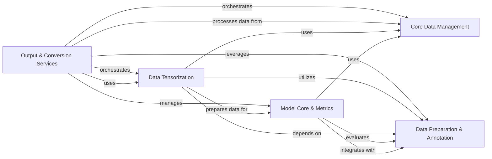

## Component Details

CoSpred is a software system designed for predicting mass spectrometry spectra of peptides. It processes raw input data, performs peptide annotation and data tensorization, utilizes a deep learning model for prediction, and converts the results into various standardized output formats, while also providing a service API for external access.

### Core Data Management
Manages data input/output operations (reading/writing HDF5, Arrow, CSV) and provides fundamental utility functions for data validation, sequence manipulation, and array reshaping.

**Related Classes/Methods**:

- <a href="https://github.com/pfizer-opensource/CoSpred/blob/master/prosit_model/io_local.py#L13-L15" target="_blank" rel="noopener noreferrer">`CoSpred.prosit_model.io_local:get_array` (13:15)</a>
- <a href="https://github.com/pfizer-opensource/CoSpred/blob/master/prosit_model/io_local.py#L26-L35" target="_blank" rel="noopener noreferrer">`CoSpred.prosit_model.io_local:to_hdf5` (26:35)</a>
- <a href="https://github.com/pfizer-opensource/CoSpred/blob/master/prosit_model/io_local.py#L52-L116" target="_blank" rel="noopener noreferrer">`CoSpred.prosit_model.io_local:from_hdf5_to_transformer` (52:116)</a>
- <a href="https://github.com/pfizer-opensource/CoSpred/blob/master/prosit_model/io_local.py#L119-L176" target="_blank" rel="noopener noreferrer">`CoSpred.prosit_model.io_local:from_hdf5` (119:176)</a>
- <a href="https://github.com/pfizer-opensource/CoSpred/blob/master/prosit_model/io_local.py#L179-L188" target="_blank" rel="noopener noreferrer">`CoSpred.prosit_model.io_local:pdfile_to_arrow` (179:188)</a>
- <a href="https://github.com/pfizer-opensource/CoSpred/blob/master/prosit_model/io_local.py#L207-L237" target="_blank" rel="noopener noreferrer">`CoSpred.prosit_model.io_local:to_arrow` (207:237)</a>
- <a href="https://github.com/pfizer-opensource/CoSpred/blob/master/prosit_model/io_local.py#L240-L283" target="_blank" rel="noopener noreferrer">`CoSpred.prosit_model.io_local:from_arrow` (240:283)</a>
- <a href="https://github.com/pfizer-opensource/CoSpred/blob/master/prosit_model/utils.py#L4-L8" target="_blank" rel="noopener noreferrer">`CoSpred.prosit_model.utils:check_mandatory_keys` (4:8)</a>
- <a href="https://github.com/pfizer-opensource/CoSpred/blob/master/prosit_model/utils.py#L11-L12" target="_blank" rel="noopener noreferrer">`CoSpred.prosit_model.utils:reshape_dims` (11:12)</a>
- <a href="https://github.com/pfizer-opensource/CoSpred/blob/master/prosit_model/utils.py#L15-L17" target="_blank" rel="noopener noreferrer">`CoSpred.prosit_model.utils:get_sequence` (15:17)</a>
- <a href="https://github.com/pfizer-opensource/CoSpred/blob/master/prosit_model/utils.py#L20-L22" target="_blank" rel="noopener noreferrer">`CoSpred.prosit_model.utils:sequence_integer_to_str` (20:22)</a>
- <a href="https://github.com/pfizer-opensource/CoSpred/blob/master/prosit_model/utils.py#L25-L39" target="_blank" rel="noopener noreferrer">`CoSpred.prosit_model.utils:peptide_parser` (25:39)</a>

### Data Preparation & Annotation
Responsible for sanitizing, transforming, and annotating raw input data, including normalization, masking, peptide fragment annotation with m/z values, and matching operations.

**Related Classes/Methods**:

- <a href="https://github.com/pfizer-opensource/CoSpred/blob/master/prosit_model/sanitize.py#L7-L19" target="_blank" rel="noopener noreferrer">`CoSpred.prosit_model.sanitize:reshape_dims` (7:19)</a>
- <a href="https://github.com/pfizer-opensource/CoSpred/blob/master/prosit_model/sanitize.py#L22-L25" target="_blank" rel="noopener noreferrer">`CoSpred.prosit_model.sanitize:reshape_flat` (22:25)</a>
- <a href="https://github.com/pfizer-opensource/CoSpred/blob/master/prosit_model/sanitize.py#L28-L35" target="_blank" rel="noopener noreferrer">`CoSpred.prosit_model.sanitize:normalize_base_peak` (28:35)</a>
- <a href="https://github.com/pfizer-opensource/CoSpred/blob/master/prosit_model/sanitize.py#L38-L42" target="_blank" rel="noopener noreferrer">`CoSpred.prosit_model.sanitize:mask_outofrange` (38:42)</a>
- <a href="https://github.com/pfizer-opensource/CoSpred/blob/master/prosit_model/sanitize.py#L45-L46" target="_blank" rel="noopener noreferrer">`CoSpred.prosit_model.sanitize:cap` (45:46)</a>
- <a href="https://github.com/pfizer-opensource/CoSpred/blob/master/prosit_model/sanitize.py#L49-L54" target="_blank" rel="noopener noreferrer">`CoSpred.prosit_model.sanitize:mask_outofcharge` (49:54)</a>
- <a href="https://github.com/pfizer-opensource/CoSpred/blob/master/prosit_model/sanitize.py#L57-L81" target="_blank" rel="noopener noreferrer">`CoSpred.prosit_model.sanitize:get_spectral_angle` (57:81)</a>
- <a href="https://github.com/pfizer-opensource/CoSpred/blob/master/prosit_model/sanitize.py#L84-L106" target="_blank" rel="noopener noreferrer">`CoSpred.prosit_model.sanitize:prediction` (84:106)</a>
- <a href="https://github.com/pfizer-opensource/CoSpred/blob/master/prosit_model/annotate.py#L7-L14" target="_blank" rel="noopener noreferrer">`CoSpred.prosit_model.annotate:adjust_masses` (7:14)</a>
- <a href="https://github.com/pfizer-opensource/CoSpred/blob/master/prosit_model/annotate.py#L17-L18" target="_blank" rel="noopener noreferrer">`CoSpred.prosit_model.annotate:get_mz` (17:18)</a>
- <a href="https://github.com/pfizer-opensource/CoSpred/blob/master/prosit_model/annotate.py#L21-L22" target="_blank" rel="noopener noreferrer">`CoSpred.prosit_model.annotate:get_mzs` (21:22)</a>
- <a href="https://github.com/pfizer-opensource/CoSpred/blob/master/prosit_model/annotate.py#L25-L43" target="_blank" rel="noopener noreferrer">`CoSpred.prosit_model.annotate:get_annotation` (25:43)</a>
- <a href="https://github.com/pfizer-opensource/CoSpred/blob/master/prosit_model/match.py#L7-L11" target="_blank" rel="noopener noreferrer">`CoSpred.prosit_model.match:read_attribute` (7:11)</a>
- <a href="https://github.com/pfizer-opensource/CoSpred/blob/master/prosit_model/match.py#L14-L27" target="_blank" rel="noopener noreferrer">`CoSpred.prosit_model.match:peptide_parser` (14:27)</a>
- <a href="https://github.com/pfizer-opensource/CoSpred/blob/master/prosit_model/match.py#L30-L35" target="_blank" rel="noopener noreferrer">`CoSpred.prosit_model.match:get_forward_backward` (30:35)</a>
- <a href="https://github.com/pfizer-opensource/CoSpred/blob/master/prosit_model/match.py#L38-L48" target="_blank" rel="noopener noreferrer">`CoSpred.prosit_model.match:get_tolerance` (38:48)</a>
- <a href="https://github.com/pfizer-opensource/CoSpred/blob/master/prosit_model/match.py#L51-L55" target="_blank" rel="noopener noreferrer">`CoSpred.prosit_model.match:is_in_tolerance` (51:55)</a>
- <a href="https://github.com/pfizer-opensource/CoSpred/blob/master/prosit_model/match.py#L58-L68" target="_blank" rel="noopener noreferrer">`CoSpred.prosit_model.match:binarysearch` (58:68)</a>
- <a href="https://github.com/pfizer-opensource/CoSpred/blob/master/prosit_model/match.py#L71-L96" target="_blank" rel="noopener noreferrer">`CoSpred.prosit_model.match:match` (71:96)</a>
- <a href="https://github.com/pfizer-opensource/CoSpred/blob/master/prosit_model/match.py#L99-L112" target="_blank" rel="noopener noreferrer">`CoSpred.prosit_model.match:c_lambda` (99:112)</a>
- <a href="https://github.com/pfizer-opensource/CoSpred/blob/master/prosit_model/match.py#L115-L135" target="_blank" rel="noopener noreferrer">`CoSpred.prosit_model.match:augment` (115:135)</a>

### Model Core & Metrics
Manages the lifecycle of the prediction model, including loading pre-trained weights and custom layers, and provides functionalities for computing various performance metrics to evaluate prediction quality.

**Related Classes/Methods**:

- <a href="https://github.com/pfizer-opensource/CoSpred/blob/master/prosit_model/model.py#L14-L15" target="_blank" rel="noopener noreferrer">`CoSpred.prosit_model.model:is_weight_name` (14:15)</a>
- <a href="https://github.com/pfizer-opensource/CoSpred/blob/master/prosit_model/model.py#L18-L19" target="_blank" rel="noopener noreferrer">`CoSpred.prosit_model.model:get_loss` (18:19)</a>
- <a href="https://github.com/pfizer-opensource/CoSpred/blob/master/prosit_model/model.py#L22-L29" target="_blank" rel="noopener noreferrer">`CoSpred.prosit_model.model:get_best_weights_path` (22:29)</a>
- <a href="https://github.com/pfizer-opensource/CoSpred/blob/master/prosit_model/model.py#L32-L46" target="_blank" rel="noopener noreferrer">`CoSpred.prosit_model.model:load` (32:46)</a>
- <a href="https://github.com/pfizer-opensource/CoSpred/blob/master/prosit_model/model.py#L49-L56" target="_blank" rel="noopener noreferrer">`CoSpred.prosit_model.model:save` (49:56)</a>
- <a href="https://github.com/pfizer-opensource/CoSpred/blob/master/prosit_model/layers.py#L65-L78" target="_blank" rel="noopener noreferrer">`CoSpred.prosit_model.layers.CustomAttention:call` (65:78)</a>
- `CoSpred.prosit_model.layers.dot_product` (full file reference)
- <a href="https://github.com/pfizer-opensource/CoSpred/blob/master/prosit_model/metrics.py#L6-L8" target="_blank" rel="noopener noreferrer">`CoSpred.prosit_model.metrics.CustomMetric:__init__` (6:8)</a>
- <a href="https://github.com/pfizer-opensource/CoSpred/blob/master/prosit_model/metrics.py#L10-L11" target="_blank" rel="noopener noreferrer">`CoSpred.prosit_model.metrics.CustomMetric:update_state` (10:11)</a>
- <a href="https://github.com/pfizer-opensource/CoSpred/blob/master/prosit_model/metrics.py#L15-L16" target="_blank" rel="noopener noreferrer">`CoSpred.prosit_model.metrics.CustomMetric:result` (15:16)</a>
- <a href="https://github.com/pfizer-opensource/CoSpred/blob/master/prosit_model/metrics.py#L18-L19" target="_blank" rel="noopener noreferrer">`CoSpred.prosit_model.metrics.CustomMetric:reset_state` (18:19)</a>
- <a href="https://github.com/pfizer-opensource/CoSpred/blob/master/prosit_model/metrics.py#L22-L27" target="_blank" rel="noopener noreferrer">`CoSpred.prosit_model.metrics.spectral_distance` (22:27)</a>
- <a href="https://github.com/pfizer-opensource/CoSpred/blob/master/prosit_model/metrics.py#L30-L38" target="_blank" rel="noopener noreferrer">`CoSpred.prosit_model.metrics.masked_spectral_distance` (30:38)</a>
- <a href="https://github.com/pfizer-opensource/CoSpred/blob/master/prosit_model/metrics.py#L41-L46" target="_blank" rel="noopener noreferrer">`CoSpred.prosit_model.metrics.pearson_corr` (41:46)</a>
- <a href="https://github.com/pfizer-opensource/CoSpred/blob/master/prosit_model/metrics.py#L49-L53" target="_blank" rel="noopener noreferrer">`CoSpred.prosit_model.metrics.cos_sim` (49:53)</a>
- <a href="https://github.com/pfizer-opensource/CoSpred/blob/master/prosit_model/metrics.py#L56-L65" target="_blank" rel="noopener noreferrer">`CoSpred.prosit_model.metrics.binarize` (56:65)</a>
- <a href="https://github.com/pfizer-opensource/CoSpred/blob/master/prosit_model/metrics.py#L69-L72" target="_blank" rel="noopener noreferrer">`CoSpred.prosit_model.metrics.ComputeMetrics:__init__` (69:72)</a>
- <a href="https://github.com/pfizer-opensource/CoSpred/blob/master/prosit_model/metrics.py#L74-L135" target="_blank" rel="noopener noreferrer">`CoSpred.prosit_model.metrics.ComputeMetrics:update_state` (74:135)</a>
- <a href="https://github.com/pfizer-opensource/CoSpred/blob/master/prosit_model/metrics.py#L137-L162" target="_blank" rel="noopener noreferrer">`CoSpred.prosit_model.metrics.ComputeMetrics:return_metrics` (137:162)</a>
- <a href="https://github.com/pfizer-opensource/CoSpred/blob/master/prosit_model/metrics.py#L164-L168" target="_blank" rel="noopener noreferrer">`CoSpred.prosit_model.metrics.ComputeMetrics:result` (164:168)</a>
- <a href="https://github.com/pfizer-opensource/CoSpred/blob/master/prosit_model/losses.py#L5-L17" target="_blank" rel="noopener noreferrer">`CoSpred.prosit_model.losses.masked_spectral_distance` (5:17)</a>

### Data Tensorization
Converts processed data into numerical tensors, preparing it for input into the neural network model by encoding sequences, precursor charges, and applying m/z values.

**Related Classes/Methods**:

- <a href="https://github.com/pfizer-opensource/CoSpred/blob/master/prosit_model/tensorize.py#L19-L31" target="_blank" rel="noopener noreferrer">`CoSpred.prosit_model.tensorize:stack` (19:31)</a>
- <a href="https://github.com/pfizer-opensource/CoSpred/blob/master/prosit_model/tensorize.py#L34-L36" target="_blank" rel="noopener noreferrer">`CoSpred.prosit_model.tensorize:get_numbers` (34:36)</a>
- <a href="https://github.com/pfizer-opensource/CoSpred/blob/master/prosit_model/tensorize.py#L39-L43" target="_blank" rel="noopener noreferrer">`CoSpred.prosit_model.tensorize:get_precursor_charge_onehot` (39:43)</a>
- <a href="https://github.com/pfizer-opensource/CoSpred/blob/master/prosit_model/tensorize.py#L46-L55" target="_blank" rel="noopener noreferrer">`CoSpred.prosit_model.tensorize:get_sequence_integer` (46:55)</a>
- <a href="https://github.com/pfizer-opensource/CoSpred/blob/master/prosit_model/tensorize.py#L58-L65" target="_blank" rel="noopener noreferrer">`CoSpred.prosit_model.tensorize:parse_ion` (58:65)</a>
- <a href="https://github.com/pfizer-opensource/CoSpred/blob/master/prosit_model/tensorize.py#L68-L86" target="_blank" rel="noopener noreferrer">`CoSpred.prosit_model.tensorize:get_mz_applied` (68:86)</a>
- <a href="https://github.com/pfizer-opensource/CoSpred/blob/master/prosit_model/tensorize.py#L89-L120" target="_blank" rel="noopener noreferrer">`CoSpred.prosit_model.tensorize:csv` (89:120)</a>
- <a href="https://github.com/pfizer-opensource/CoSpred/blob/master/prosit_model/tensorize.py#L123-L138" target="_blank" rel="noopener noreferrer">`CoSpred.prosit_model.tensorize:hdf5` (123:138)</a>

### Output & Conversion Services
Provides the core prediction service API, orchestrating the data flow from input to output, and facilitates the conversion of prediction results into various standardized formats (e.g., DIANN, MSP, MGF, CSV, MaxQuant).

**Related Classes/Methods**:

- <a href="https://github.com/pfizer-opensource/CoSpred/blob/master/prosit_model/msp_parser.py#L22-L68" target="_blank" rel="noopener noreferrer">`CoSpred.prosit_model.msp_parser:from_msp_prosit` (22:68)</a>
- <a href="https://github.com/pfizer-opensource/CoSpred/blob/master/prosit_model/msp_parser.py#L71-L131" target="_blank" rel="noopener noreferrer">`CoSpred.prosit_model.msp_parser:from_msp_propel` (71:131)</a>
- <a href="https://github.com/pfizer-opensource/CoSpred/blob/master/prosit_model/msp_parser.py#L135-L156" target="_blank" rel="noopener noreferrer">`CoSpred.prosit_model.msp_parser:dict2mgf` (135:156)</a>
- <a href="https://github.com/pfizer-opensource/CoSpred/blob/master/prosit_model/msp_parser.py#L160-L189" target="_blank" rel="noopener noreferrer">`CoSpred.prosit_model.msp_parser:copy_from_msp` (160:189)</a>
- <a href="https://github.com/pfizer-opensource/CoSpred/blob/master/prosit_model/msp_parser.py#L192-L283" target="_blank" rel="noopener noreferrer">`CoSpred.prosit_model.msp_parser:msp2mgf` (192:283)</a>
- <a href="https://github.com/pfizer-opensource/CoSpred/blob/master/prosit_model/msp_parser.py#L286-L305" target="_blank" rel="noopener noreferrer">`CoSpred.prosit_model.msp_parser:sampling_peptidelist` (286:305)</a>
- <a href="https://github.com/pfizer-opensource/CoSpred/blob/master/prosit_model/msp_parser.py#L308-L337" target="_blank" rel="noopener noreferrer">`CoSpred.prosit_model.msp_parser:main` (308:337)</a>
- <a href="https://github.com/pfizer-opensource/CoSpred/blob/master/prosit_model/converters/diannoutput.py#L12-L15" target="_blank" rel="noopener noreferrer">`CoSpred.prosit_model.converters.diannoutput:rename_column` (12:15)</a>
- <a href="https://github.com/pfizer-opensource/CoSpred/blob/master/prosit_model/converters/diannoutput.py#L18-L59" target="_blank" rel="noopener noreferrer">`CoSpred.prosit_model.converters.diannoutput:read` (18:59)</a>
- <a href="https://github.com/pfizer-opensource/CoSpred/blob/master/prosit_model/converters/diannoutput.py#L62-L63" target="_blank" rel="noopener noreferrer">`CoSpred.prosit_model.converters.diannoutput:write` (62:63)</a>
- <a href="https://github.com/pfizer-opensource/CoSpred/blob/master/prosit_model/converters/diannoutput.py#L66-L131" target="_blank" rel="noopener noreferrer">`CoSpred.prosit_model.converters.diannoutput:convert_prediction` (66:131)</a>
- <a href="https://github.com/pfizer-opensource/CoSpred/blob/master/prosit_model/converters/diannoutput.py#L138-L148" target="_blank" rel="noopener noreferrer">`CoSpred.prosit_model.converters.diannoutput.createLongFileFormat:__init__` (138:148)</a>
- <a href="https://github.com/pfizer-opensource/CoSpred/blob/master/prosit_model/converters/msp.py#L156-L186" target="_blank" rel="noopener noreferrer">`CoSpred.prosit_model.converters.msp:generate_mod_strings` (156:186)</a>
- <a href="https://github.com/pfizer-opensource/CoSpred/blob/master/prosit_model/converters/msp.py#L195-L255" target="_blank" rel="noopener noreferrer">`CoSpred.prosit_model.converters.msp.Converter:convert` (195:255)</a>
- <a href="https://github.com/pfizer-opensource/CoSpred/blob/master/prosit_model/converters/msp.py#L259-L288" target="_blank" rel="noopener noreferrer">`CoSpred.prosit_model.converters.msp.Spectrum:__init__` (259:288)</a>
- <a href="https://github.com/pfizer-opensource/CoSpred/blob/master/prosit_model/converters/msp.py#L290-L309" target="_blank" rel="noopener noreferrer">`CoSpred.prosit_model.converters.msp.Spectrum:__str__` (290:309)</a>
- <a href="https://github.com/pfizer-opensource/CoSpred/blob/master/prosit_model/converters/msp.py#L71-L84" target="_blank" rel="noopener noreferrer">`CoSpred.prosit_model.converters.msp.get_ions` (71:84)</a>
- <a href="https://github.com/pfizer-opensource/CoSpred/blob/master/prosit_model/converters/msp.py#L104-L125" target="_blank" rel="noopener noreferrer">`CoSpred.prosit_model.converters.msp.generate_mods_string_tuples` (104:125)</a>
- <a href="https://github.com/pfizer-opensource/CoSpred/blob/master/prosit_model/converters/msp.py#L9-L18" target="_blank" rel="noopener noreferrer">`CoSpred.prosit_model.converters.msp.preprocess_sequence` (9:18)</a>
- <a href="https://github.com/pfizer-opensource/CoSpred/blob/master/prosit_model/converters/msp.py#L21-L44" target="_blank" rel="noopener noreferrer">`CoSpred.prosit_model.converters.msp.plot_sequence` (21:44)</a>
- <a href="https://github.com/pfizer-opensource/CoSpred/blob/master/prosit_model/converters/generic.py#L34-L69" target="_blank" rel="noopener noreferrer">`CoSpred.prosit_model.converters.generic:convert_spectrum` (34:69)</a>
- <a href="https://github.com/pfizer-opensource/CoSpred/blob/master/prosit_model/converters/generic.py#L88-L98" target="_blank" rel="noopener noreferrer">`CoSpred.prosit_model.converters.generic.Converter:fill_queue` (88:98)</a>
- <a href="https://github.com/pfizer-opensource/CoSpred/blob/master/prosit_model/converters/generic.py#L108-L115" target="_blank" rel="noopener noreferrer">`CoSpred.prosit_model.converters.generic.Converter:to_csv` (108:115)</a>
- <a href="https://github.com/pfizer-opensource/CoSpred/blob/master/prosit_model/converters/generic.py#L117-L123" target="_blank" rel="noopener noreferrer">`CoSpred.prosit_model.converters.generic.Converter:convert` (117:123)</a>
- <a href="https://github.com/pfizer-opensource/CoSpred/blob/master/prosit_model/converters/generic.py#L80-L83" target="_blank" rel="noopener noreferrer">`CoSpred.prosit_model.converters.generic.Converter.batch` (80:83)</a>
- <a href="https://github.com/pfizer-opensource/CoSpred/blob/master/prosit_model/converters/generic.py#L85-L86" target="_blank" rel="noopener noreferrer">`CoSpred.prosit_model.converters.generic.Converter.slice_data` (85:86)</a>
- <a href="https://github.com/pfizer-opensource/CoSpred/blob/master/prosit_model/converters/generic.py#L100-L106" target="_blank" rel="noopener noreferrer">`CoSpred.prosit_model.converters.generic.Converter.get_converted` (100:106)</a>
- <a href="https://github.com/pfizer-opensource/CoSpred/blob/master/prosit_model/converters/maxquant.py#L67-L119" target="_blank" rel="noopener noreferrer">`CoSpred.prosit_model.converters.maxquant:convert_prediction` (67:119)</a>
- <a href="https://github.com/pfizer-opensource/CoSpred/blob/master/prosit_model/converters/maxquant.py#L63-L64" target="_blank" rel="noopener noreferrer">`CoSpred.prosit_model.converters.maxquant:write` (63:64)</a>
- <a href="https://github.com/pfizer-opensource/CoSpred/blob/master/prosit_model/server.py#L24-L25" target="_blank" rel="noopener noreferrer">`CoSpred.prosit_model.server:hello` (24:25)</a>
- <a href="https://github.com/pfizer-opensource/CoSpred/blob/master/prosit_model/server.py#L28-L33" target="_blank" rel="noopener noreferrer">`CoSpred.prosit_model.server:predict` (28:33)</a>
- <a href="https://github.com/pfizer-opensource/CoSpred/blob/master/prosit_model/server.py#L37-L48" target="_blank" rel="noopener noreferrer">`CoSpred.prosit_model.server:return_generic` (37:48)</a>
- <a href="https://github.com/pfizer-opensource/CoSpred/blob/master/prosit_model/server.py#L52-L63" target="_blank" rel="noopener noreferrer">`CoSpred.prosit_model.server:return_msp` (52:63)</a>
- <a href="https://github.com/pfizer-opensource/CoSpred/blob/master/prosit_model/server.py#L67-L78" target="_blank" rel="noopener noreferrer">`CoSpred.prosit_model.server:return_msms` (67:78)</a>

### [FAQ](https://github.com/CodeBoarding/GeneratedOnBoardings/tree/main?tab=readme-ov-file#faq)