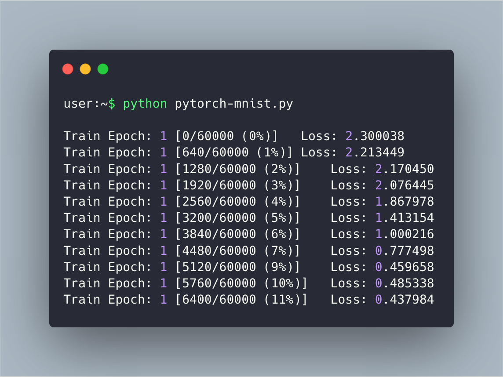
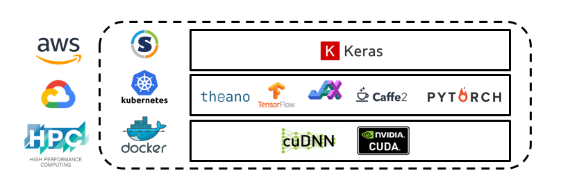

# GPU Utilities



**Core Principle:** Enabling hardware-accelerated experiments at Pfizer with diverse sets of dependencies and computing environments.

**Maintainers:** [Vishnu Sresht](mailto:vishnu.sresht@pfizer.com) and [Stephen Ra](mailto:stephen.ra@pfizer.com)



These container-based (Docker and Singularity) utilities are for quickly standing up an
environment within Pfizer's GPU
infrastructure ([HPC](http://docs.hpc.pfizer.com/hpcc/index.html) clusters including [Delta HPC](http://hpcdocs.pfizer.com/delta/), [AWS](http://pfizerpedia.pfizer.com/index.php/AWS_Digital_Lab),
Google Cloud, and NVIDIA DGX instances) for hardware-accelerated machine learning. Moreover, these utilities have been developed to serve as the basis for reproducible modeling workflows and pipelines. If you're interested in learning more or contributing, please feel free to reach out to us at
[machinelearning@pfizer.com](mailto:machinelearning@pfizer.com) or raise an issue on [GitHub](https://github.com/pfizerrd/dl-gpu-utils) (see [Contributing](#contributing) for more information).

## Installation

### Cloning

The utilities currently exist as a repository in the [Pfizer R&D GitHub organization](https://github.com/PfizerRD/dl-gpu-utils). First, clone the repository:

```sh
git clone git@github.com:PfizerRD/dl-gpu-utils.git
```

---

## Support

We currently support the Python bindings of TensorFlow, PyTorch, JAX, Keras, Theano, and MXNet. Additionally, we have experimental support for distributed training through OpenMPI and [Horovod](https://github.com/horovod/horovod).

Additionally, we support the DeepChem, RDKit, and OpenEye (Python 3.7 only) cheminformatics toolkits.

---

## Getting Started  

### HPC/HPC-C (RHEL)

This repository contains two Conda environment files (for Python 2 and Python 3):

1. `py2gpu_environment.yml`

2. `py3gpu_environment.yml`

To create an environment that’s accessible from any HPC node, the Conda environments need to be created either on WIP or on an HPC workspace.

To create these environments, we only need to run the following snippets once (from any HPC node):

```sh
$ ssh your-hpc-instance.pfizer.com
$ cd /hpc/your-directory/
$ git clone git@github.com:PfizerRD/dl-gpu-utils.git
$ cd dl-gpu-utils
$ bash -e install_miniconda.sh
$ bash -e setup_hpcc_environments.sh
```

#### Activating the Environment

To use the environment, write jobs scripts that contain one of
the two following snippets:  
  
**Python 3.x**:

```sh
module use /hpc/grid/wip_adw_compsci/workspace/projects/deep_learning/dl-gpu-utils/gpu_modules
module load py3gpu
cd /hpc/grid/wip_adw_compsci/workspace/projects/deep_learning/dl-gpu-utils/quick_tests/
cd tf-test         # or pytorch-test or keras-test
python test00.py   # or test01.py
```

**Python 2.7**

```sh
module use /hpc/grid/wip_adw_compsci/workspace/projects/deep_learning/dl-gpu-utils/gpu_modules
module load py2gpu
cd /hpc/grid/wip_adw_compsci/workspace/projects/deep_learning/dl-gpu-utils/quick_tests/
cd tf-test         # or pytorch-test or keras-test
python test00.py   # or test01.py
```

**Note:** You *could* run the snippets above in interactive mode after `ssh`ing into
a GPU node such as `adwgpu600`. If you want to do that, you **must** first reserve time
on the node by successfully running a long sleep job on that node:  

```sh
bsub -W 336:00 -n 8 -q gpu -m adwgpu600 sleep 2000000
```

For the `adwgpu700` GPU node, you can submit specifically as follows:

```sh
`bsub -R gpuv100 -R "select[ngpus>0] rusage[ngpus_excl_p=4]" -sla gpu_adwgpu700_class -q gpu python test00.py
```

The additional resource flag enables you specification of GPU exclusivity. For the `adwgpu700` GPU node, this is `ngpus_excl_p=[1,4]`.

#### Submitting Jobs to HPC-C GPU Nodes

The script `gpu_run.py` in the `scripts` folder allows you to submit to NVIDIA Tesla K80/P100 nodes on HPC-C. An example:

```sh
git clone git@github.com:PfizerRD/dl-gpu-utils.git ~/Code/dl-gpu-utils  # Clone the repo somewhere
cd dl-gpu-utils/scripts # go to the scripts directory
python ~/Code/dl-gpu-utils/scripts/gpu_run.py /path/to/your/script/foo.py
> Submitting job foo_1525981273...
> Job <657280> is submitted to queue <gpu>.
```

By default, this script submits to the `gpu` queue and asks for the `gpup100` resource (i.e. one of our two P100 nodes).

You can submit to K80 nodes (the `gpuk80` resource) by using:

```sh
python ~/Code/dl-gpu-utils/scripts/gpu_run.py --queue-type gpuk80 /path/to/your/script/foo.py
```

You can also submit to a specific P100 node by using:

```sh
python ~/Code/dl-gpu-utils/scripts/gpu_run.py --node adwgpu601 /path/to/your/script/foo.py
```

Any arguments to your `foo.py` script can be fed, as usual, at the end of the command line (e.g. an arg for the relevant data directory):

```sh
python ~/Code/dl-gpu-utils/scripts/gpu_run.py --node adwgpu601 /path/to/your/script/foo.py --data bar.csv
```

The script takes the following inputs (to be provided before the name of the python script you actually want to run (i.e., before `foo.py` in the case above): 
 
| Argument            | Description                                                                                                           |
| ------------------- | --------------------------------------------------------------------------------------------------------------------- |
| `--job-name`        | job name                                                                                                              |
| `--queue-name`      | queue name, default=`gpu`                                                                                             |
| `--queue-type`      | queue type, `gpuv100`, `gpup100` or `gpuk80`, default=`gpup100`                                                       |
| `--node`            | specific node [without .pfizer.com extension], example: `adwgpu600`                                                   |
| `--resources`       | lsf resource string, default="`select[ngpus>0] rusage[ngpus_excl_p=1]`"                                               |
| `--number-of-nodes` | number of nodes, default=`1`                                                                                          |
| `--module-path`     | path to gpu dl modules, default=`/hpc/grid/wip_adw_compsci/workspace/projects/deep_learning/dl-gpu-utils/gpu_modules` |
| `--gpu-module`      | GPU module to load, default=`py3gpu`                                                                                  |
| `--dry-run`         | print script and exit                                                                                                 |
| `--pythonpath`      | things to add to pythonpath, default=''                                                                               |

Note that this script sources `/hpc/grid/lsfhpcprodchem/conf/profile.lsf` before calling `bsub`, which assumes rightful permission to the cluster. To change to HPC, use a different cluster profile script (you'll also have to setup a Python environment at a location accessible by the nodes you want to submit to). This is currently in development so stay tuned.

#### Monitoring Jobs

You can monitor the progress of jobs by:

1. `watch bjobs` for overall status
2. `ssh`-ing into the node on which the script is running:

```sh
ssh gpu0
cd .lsbatch
watch -n 10 *.<job_number>.out
```

**Poor Man's Tensorboard**

You can plot the loss in real-time using:

```sh
ssh gpu0
cd .lsbatch
grep 'val_loss' *.<job_number>.out | awk '{ print $NF }' | gnuplot -p -e "set terminal dumb size 120, 30; set autoscale; plot '-' with lines title 'val_loss' "
```

Your output should look like:

```sh
  8 ++--------------+---------------+---------------+---------------+---------------+---------------+--------------++
    +               +               +               +               +               +               +   loss ****** +
    |                                                                                                               |
    *                                                                                                               |
  7 *+                                                                                                             ++
    *                                                                                                               |
    *                                                                                                               |
  6 *+                                                                                                             ++
    *                                                                                                               |
    *                                                                                                               |
    *                                                                                                               |
  5 *+                                                                                                             ++
    *                                                                                                               |
    *                                                                                                               |
  4 *+                                                                                                             ++
    **                                                                                                              |
    |*                                                                                                              |
    |*                                                                                                              |
  3 +**                                                                                                            ++
    | ***                                                                                                           |
    |  ********* *                                                                                                  |
  2 ++   *************************************************************************************************         ++
    |                                     *       *   *                *    *    ****  **********  ******           |
    |                                                                                                               |
    +               +               +               +               +               +               +               +
  1 ++--------------+---------------+---------------+---------------+---------------+---------------+--------------++
    0              200             400             600             800             1000            1200            1400
```

#### Creating New Environments

```sh
ssh hpccssh.pfizer.com
DL_HOME=/hpc/grid/wip_adw_compsci/workspace/projects/deep_learning/
module use ${DL_HOME}/dl-gpu-utils/gpu_modules
module load cuda-cudnn
module load miniconda3
conda env create -f py2_pytorch_031_environment.yml -p ${DL_HOME}/Python/py2_pytorch_031 -vv
# OR conda create -p ${DL_HOME}/Python/deepchem_py3 --clone ${DL_HOME}/Python/py3gpu
```

Then create a corresponding module file:

```sh
cp -r ${DL_HOME}/dl-gpu-utils/py3gpu ${DL_HOME}/dl-gpu-utils/deepchem_py3
sed -i 's/py3gpu/deepchem_py3/' ${DL_HOME}/dl-gpu-utils/deepchem_py3/1.0.lua
```

When running with `gpu_run.py`, just append the options `--gpu-module deepchem_py3`. 


### Debian/Ubuntu

First, navigate to root of the `dl-gpu-utils` directory and build your desired Docker image. Each Dockerfile has suitably defined args, as well. For example, to build a Conda environment with base CUDA 9.0 against Ubuntu 16.04 LTS, we use the `conda_py3gpu` Dockerfile where we define our OS, OS version, and our Python version of choice:

```sh
$ docker build -f dockerfiles/conda_py3gpu/Dockerfile -t your-docker-id --build-arg os=ubuntu --build-arg osversion=16.04 --build-arg pyversion=3 .
```
 
Each Dockerfile builds a set of desired and common dependencies (e.g. `tensorflow-gpu`) in the form of a .yml list at the root directory (e.g. `py3gpu_environment.yml`). You can clamp to a particular version, if needed (e.g. `tensorflow-gpu>=1.8`).  This makes it easy to `pip freeze` a set of dependencies and quickly build your image.

Once your image has been built, you can run your Docker container off your image:

```sh
$ nvidia-docker run -it -v /path/to/code/:/code -v /etc/group:/etc/group:ro -v /etc/passwd:/etc/passwd:ro -u $( id -u $USER ):$( id -g $USER ) your-docker-id
```

## Building with Singularity

### Step 1. Building Your Container

To build your own Singularity container on Delta HPC, first clone this repo. You will need to build the base Singularity image (**Note**: executing `singularity build` requires root permissions):

```sh
$ cd singularity/base
$ sudo singularity build conda-base.sif Singularity

```

Once you have built the base image `conda-base.sif`, you will need to create a sub-directory for your Singularity image and recipe under the `singularity` directory and create an `env.yml` file:

```sh
$ cd ..
$ mkdir foo
$ touch foo/env.yml
```

A simple example of a `env.yml` spec (**Note**: do not change the environment name and prefix from `myenv`):

```yaml
name: myenv
channels:
  - conda-forge
  - anaconda
  - defaults
dependencies:
  - jupyterlab
  - matplotlib
  - numpy
  - pandas
  - pip
  - python=3.8
  - scipy
  - pip:
    - tensorflow-gpu

prefix: /opt/conda/envs/myenv
```

Once you have your `env.yml`, change the Singularity recipe (first line) to build against the path of the base image (e.g. `conda-base.sif`). You can then build your image:

```sh
$ cd foo
$ singularity build foo.sif Singularity
```

Once you've build the Singularity image successfully, please commit your `env.yml` file and push the change to a new branch `singularity_foo`. Please then submit a pull request. Once changes have been approved and merged, they will be pulled (alternatively, if you have permissions you can run `git pull`) on Delta HPC at `/gpfs/workspace/projects/methods_development/deep_learning/dl-gpu-utils`.

Lastly, copy your image into its corresponding directory on Delta HPC:

```sh
$ scp foo.sif YOUR_NT_ID@delta-login1.pfizer.com:/gpfs/workspace/projects/methods_development/deep_learning/dl-gpu-utils/singularity/foo/
```

### Step 2. Creating Your Module

This step is necessary to ensure that you can run Python commands from your Singularity container with simple invocations like `module load` and `python`.

First, you need to create a sub-directory for your module within the `gpu_modules` directory and create a Lua script `1.0.lua`. From the root of your cloned `dl-gpu-utils` repo:

```sh
$ cd gpu_modules
$ mkdir foo
$ touch foo/1.0.lua
```

Your Lua script should look like this:

```lua
load("medsci")
load("cuda-cudnn/10.0.130")
setenv("SINGULARITY_BINDPATH", "/gpfs,/nfs,")
setenv("SINGULARITY_OE_LICENSE", "/gpfs/apps/medsci/stacks/noOS/software/openeye/2020.0.4/../oe_license.txt")
setenv("SINGULARITY_CONTAINER", "/gpfs/workspace/projects/methods_development/deep_learning/dl-gpu-utils/singularity/foo/foo.sif")
set_alias("python3", "singularity run --nv $SINGULARITY_CONTAINER python")
set_alias("python", "singularity run --nv $SINGULARITY_CONTAINER python")
```

Once created, commit and push changes to your `foo` branch and submit a pull request for review. Once these changes have been approved and merged, they will be pulled / you will run `git pull` on Delta HPC:

```sh
$ cd /gpfs/workspace/projects/methods_development/deep_learning/dl-gpu-utils
$ git pull
```

Lastly, navigate to `/gpfs/workspace/projects/methods_development/modulefiles` on Delta HPC and run:

```sh
$ ln -s python-vsml /gpfs/workspace/projects/methods_development/dl-gpu-utils/gpu_modules/foo
```

This will ensure that any subsequent updates to your module is handled via `git` and that all the aliases are properly defined / handled.

---

## Usage

### Running Jupyter

To be able to run Jupyter Notebooks or Jupyter Lab in an NVIDIA Docker container on a remote machine, you need to ssh into your remote instance with port forwarding enabled. The default for Jupyter notebook is typically 9999:

```sh
$ ssh -L 9999:127.0.0.1:6006 your-username@your-gpu-instance.pfizer.com
```

This will forward port 6006 of the remote instance to your local machine (localhost) on port 9999. Next, instantiate a run-time NVIDIA Docker container and specifying the open localhost port by passing the `-p` flag:


```sh
$ nvidia-docker run -p 6006:6006 -it -v /path/to/code/:/code -v /etc/group:/etc/group:ro -v /etc/passwd:/etc/passwd:ro -u $( id -u $USER ):$( id -g $USER ) py3gpu
```

Now that tunneling is established, you can now start a Jupyter notebook or lab server in the container instance. By passing `--allow-root`, this assumes you also have root permissions in the container:

```sh
jupyter notebook --ip 0.0.0.0 --port 6006 --allow-root
```


### Running TensorBoard
 
TensorBoard is an excellent visual tool for visualizing and exploring your model training. To monitor important model metrics, one only needs to percolate a bunch of tf.summarys on tensors in the code. For example, Keras has a TensorBoard callback that writes out logs for TensorBoard to a pre-specified directory and allows you to visualize graphs of your training, validation, and test metrics as well as some model internals:
 
```python
tensorboard_callback = keras.callbacks.TensorBoard(log_dir='./logs', histogram_freq=0, batch_size=32, write_graph=True, write_grads=False, write_images=False, embeddings_freq=0, embeddings_layer_names=None, embeddings_metadata=None)

callbacks_list = [tensorboard_callback]
```

To be able to run TensorBoard in an NVIDIA Docker container on a remote machine and have it map to your local machine's port to be able to render in-browser, you can ssh with port forwarding enabled:
 
```sh
$ ssh -L 16006:127.0.0.1:6006 your-username@your-gpu-instance.pfizer.com
```
 
This will forward port 6006 of the remote instance to your local machine on port 16006.
 
Once on your remote machine, you can execute `nvidia-docker run` with arg `-p` to specify the open localhost port for the container:
 
```sh
$ nvidia-docker run -p 6006:6006 -it -v /path/to/code/:/code -v /etc/group:/etc/group:ro -v /etc/passwd:/etc/passwd:ro -u $( id -u $USER ):$( id -g $USER ) py3gpu
```
 
After you've run the Docker container, you should then execute your code and then start the Tensorboard server. The TensorBoard default port is set to `6006` (this can be changed by using the `--port` flag). Make sure the path to your logs is congruent with the callback `log_dir` path or output directory:
 
```sh
$ tensorboard --logdir=/full/path/to/your/logs
```
 
Once you've started the TensorBoard server, you can then navigate to http://127.0.0.1:16006 on your local machine's browser to use TensorBoard. This is an example:


### Running Tests

Here's an example of how to run the test scripts for each environment. First, navigate to the `tests` directory:

```sh
$ ssh your-gpu-instance.domain.com
$ nvidia-docker run -it -v /home/your-directory/Code/dl-gpu-utils/:/workspace/dl-gpu-utils -v /etc/group:/etc/group:ro -v /etc/passwd:/etc/passwd:ro -u $( id -u $USER ):$( id -g $USER ) py3gpu
$ cd /workspace/dl-gpu-utils/tests/
```

Next, choose the appropriate tests for your library or set of primitives (e.g. TensorFlow, PyTorch, Theano, etc.). In this example, we'll run a basic TensorFlow test[^1] that will print your verison of TensorFlow, embed a variable-length string as a constant in a TensorFlow graph, instantiate the graph with a call to `tf.Session()`, and lastly print the output:

```sh
$ cd tf-test
$ python test00.py

Tensorflow version: 1.12.0


Hello, TensorFlow!
```

---

## Contributing

We welcome any and all contributions. For a good place to start, check [existing issues](https://github.com/PfizerRD/dl-gpu-utils/issues):


If you would like to submit pull
requests, please make sure you base your pull requests off the latest version
of the repo's `master` branch. Keep your fork synced by setting its `upstream`
remote to `PfizerRD/repo-name` and running:

```sh
# If your branch only has commits from master but is outdated
git pull --ff-only upstream master

# If your branch is outdated and has diverged from the repo's master branch
git pull --rebase upstream master
```


[^1]: Note that in TensorFlow 2.0, `tf.Session.run` calls are replaced in favor of the eager execution model.